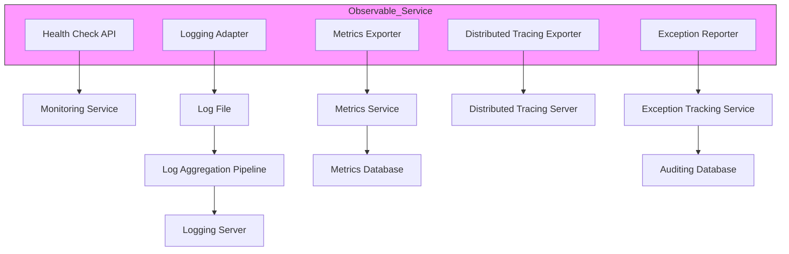
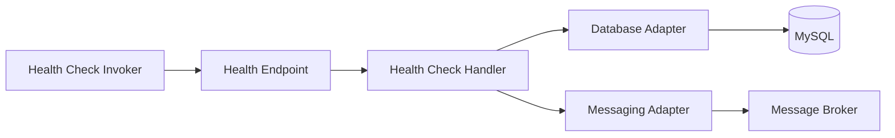
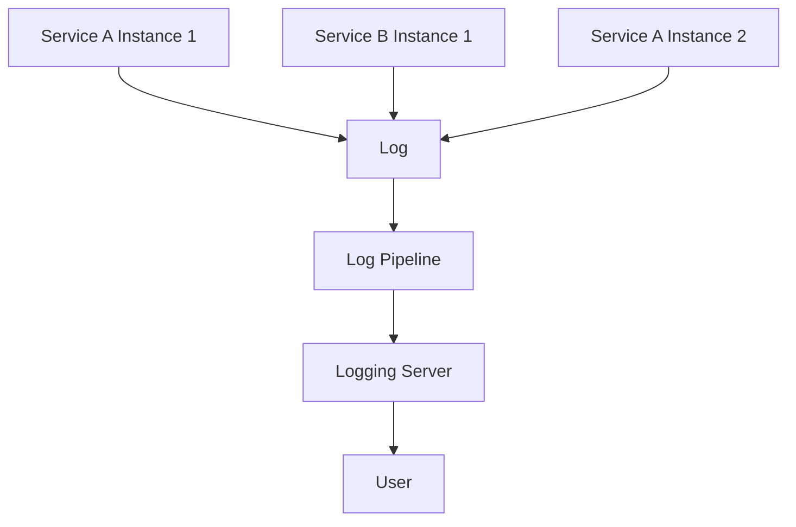
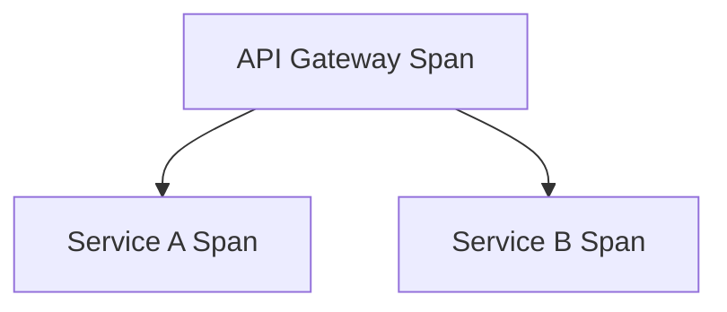
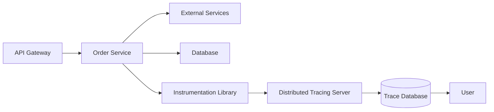
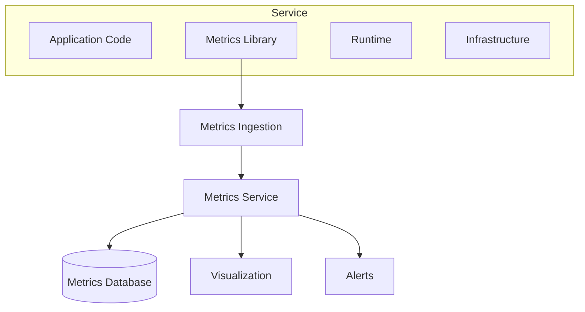
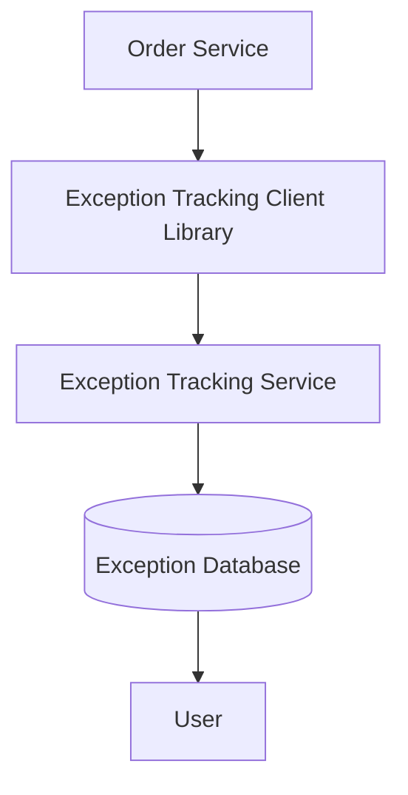

# Observability Pattern HL01

*Source: *

---

# CHAPTER 11 — Developing Production-Ready Services

---

# 11.2 Configuration Management (Continuation Context)

## Figure 11.8 — Configuration Retrieval Flow

```mermaid
flowchart LR
    A[Deployment Infrastructure] -->|Configures| B[Process]
    B --> C[Environment Variables]
    C --> D[Order History Service Instance]
    D -->|getConfiguration(orderHistoryService)| E[Configuration Server]

    E --> F[BOOTSTRAP_SERVERS=kafka:9092]
    E --> G[AWS_ACCESS_KEY_ID=...]
    E --> H[AWS_SECRET_ACCESS_KEY=...]
    E --> I[AWS_REGION=...]
```

---

## Description

On startup, a service instance retrieves configuration properties from a configuration server.
The deployment infrastructure provides the configuration properties for accessing the configuration server.

---

## Spring Cloud Config

* Server-based configuration framework
* Components:

  * Config server
  * Config client

### Supported Backends

* Git
* Vault
* Databases

### Features

#### Centralized configuration

* All configuration properties stored in one place
* Eliminates duplication

#### Encryption

* Supports encryption of sensitive data
* Requires decryption at runtime

#### Dynamic reconfiguration

* Detect changes
* Reload configuration dynamically

---

## Drawback

* Adds infrastructure dependency
* Requires setup and maintenance

---

# 11.3 Designing Observable Services

---

## Problem Context

* Production failures must be:

  * Detected
  * Diagnosed
  * Resolved quickly

* Developers must:

  * Track service health
  * Analyze logs
  * Monitor performance
  * Trace requests

---

## Observability Patterns

### List of Patterns

* Health check API
* Log aggregation
* Distributed tracing
* Exception tracking
* Application metrics
* Audit logging

---

## Figure 11.9 — Observability Architecture



---

# 11.3.1 Using the Health Check API Pattern

---

## Problem

A service may:

* Be running but not ready
* Fail partially (e.g., DB unavailable)
* Fail to process requests

---

## Solution

Expose a health check endpoint:

```http
GET /health
```

---

## Behavior

* Returns:

  * HTTP 200 → healthy
  * HTTP 500/503 → unhealthy

---

## Example Use Cases

* Database connectivity
* Message broker availability
* External API health

---

## Failure Scenarios

* Service startup delay
* DB connection failure
* Downstream dependency failure

---

## Figure 11.10 — Health Check Flow



---

## Implementation (Spring Boot Actuator)

```http
GET /actuator/health
```

---

## Custom Health Indicator

```java
public class CustomHealthIndicator implements HealthIndicator {
    public Health health() {
        if (checkDependency()) {
            return Health.up().build();
        }
        return Health.down().build();
    }
}
```

---

## Invocation

* Kubernetes probes
* Service registry (Eureka)
* Monitoring systems

---

# 11.3.2 Applying the Log Aggregation Pattern

---

## Problem

* Logs distributed across services
* Difficult to:

  * Search
  * Analyze
  * Correlate

---

## Solution

Centralized logging system

---

## Figure 11.11 — Log Aggregation Pipeline



---

## Logging Infrastructure

### ELK Stack

* Elasticsearch → storage
* Logstash → ingestion
* Kibana → visualization

---

## Alternatives

* Fluentd
* AWS CloudWatch Logs

---

## Logging Libraries

* Logback
* Log4j
* SLF4J

---

## Logging Considerations

* Structured logging (JSON)
* Correlation IDs
* Log levels

---

# 11.3.3 Using the Distributed Tracing Pattern

---

## Problem

* Hard to diagnose latency
* Multiple service interactions

---

## Solution

Assign:

* Trace ID
* Span ID

---

## Concepts

### Trace

* Entire request lifecycle

### Span

* Individual operation

---

## Figure 11.12 — Trace Example



---

## Trace Example Log

```text
traceId=abc123 spanId=xyz789 parentSpanId=def456
```

---

## Figure 11.13 — Distributed Tracing Architecture



---

## Instrumentation

### Options

* Manual
* AOP (Spring Cloud Sleuth)

---

## Tracing Systems

* Zipkin
* Tempo
* AWS X-Ray

---

## Trace Context Propagation

Headers:

```
X-B3-TraceId
X-B3-SpanId
X-B3-ParentSpanId
```

---

# 11.3.4 Applying the Application Metrics Pattern

---

## Problem

Need real-time visibility into:

* Performance
* Resource usage
* Business metrics

---

## Figure 11.14 — Metrics Architecture



---

## Metric Structure

* Name
* Value
* Timestamp
* Dimensions

---

## Example

```text
name=cpu_percent
value=68
timestamp=...
dimensions:
  service=order-service
  instance=1
```

---

## Types

* Counter
* Gauge
* Histogram

---

## Implementation (Micrometer)

```java
meterRegistry.counter("placed_orders").increment();
meterRegistry.counter("approved_orders").increment();
meterRegistry.counter("rejected_orders").increment();
```

---

## Delivery Models

### Push

* Service sends metrics

### Pull (Prometheus)

```http
GET /actuator/prometheus
```

---

# 11.3.5 Using the Exception Tracking Pattern

---

## Problem

* Exceptions scattered in logs
* Hard to deduplicate
* Hard to analyze

---

## Solution

Centralized exception tracking service

---

## Figure 11.15 — Exception Tracking



---

## Features

* Deduplication
* Alerts
* UI for debugging

---

## Tools

* Sentry
* Honeybadger

---

# 11.3.6 Applying the Audit Logging Pattern

---

## Purpose

Track:

* User actions
* Compliance events
* Security violations

---

## Implementation Options

### 1. Inline Code

* Direct logging in business logic

### 2. AOP

* Intercept method calls

### 3. Event Sourcing

* Persist all events

---

## Trade-offs

| Approach       | Advantage        | Disadvantage   |
| -------------- | ---------------- | -------------- |
| Inline         | Simple           | Pollutes logic |
| AOP            | Clean separation | Complex        |
| Event sourcing | Full history     | High cost      |

---

# Exception Tracking Services

* Honeybadger
* Sentry

Features:

* Receive exceptions
* Provide UI
* Alert developers

---

# Audit Logging

* Records user behavior
* Stored in audit database
* Used for compliance

---

# Additional Techniques

## AOP-Based Logging

* Intercepts method calls
* Automatically logs events

---

## Event Sourcing

* Stores every state change
* Enables replay

---

# 11.4 Developing Services Using the Microservice Chassis Pattern

---

## Requirements for Production Services

* Configuration management
* Logging
* Metrics
* Tracing
* Exception tracking
* Health checks
* Security

---

## Concept

A **microservice chassis** provides:

* Standard infrastructure
* Reusable components
* Consistent behavior

---

## Goal

Avoid:

* Reimplementing infrastructure per service
* Inconsistent observability

---

## Outcome

* Faster development
* Better reliability
* Standardized operations
