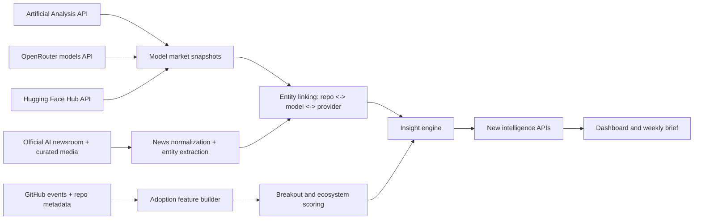

## Overview

Tai lieu nay de xuat nhung use case gia tri nhat co the xay tren du lieu hien co cua repo `github`, khong bi gioi han boi nhung use case da ton tai. Muc tieu la chuyen he thong tu mot dashboard mo ta su kien GitHub thanh mot lop `AI market intelligence` va `developer adoption intelligence`.

Pham vi:

- dua tren du lieu noi bo dang co trong repo
- de xuat them nhung nguon enrich ben ngoai kha thi nhat
- uu tien use case co the tao gia tri san pham ro rang, khong chi dep ve dashboard
- tach ro `lam ngay duoc`, `can enrich`, va `chien luoc dai hon`

Assumption:

- Chung ta dang muon toi uu cho mot san pham phan tich he sinh thai AI, khong phai mot cong cu generic cho moi GitHub repo.
- Gia tri cao nhat den tu viec tra loi cau hoi `cai gi dang duoc adoption`, `tai sao`, `boi ai`, va `nen hanh dong gi tiep theo`.
- Nguoi dung muc tieu co the la founder, PM, VC/analyst, developer relations, hoac team AI platform.

Non-goals:

- Khong de xuat crawl khap moi website AI news.
- Khong de xuat mot graph RAG/agent phuc tap truoc khi co use case dung.

## Current State

### Du lieu dang co trong repo

Code hien tai cho thay he thong da co 2 lop du lieu rat hieu dung:

1. Event stream tu GitHub public events
2. Repo metadata tu GitHub Repos API

Theo code hien tai:

- Event pipeline: `GitHub Events API -> Kafka -> Spark -> ClickHouse + Parquet`
- Event types dang theo doi: `WatchEvent`, `ForkEvent`, `PushEvent`, `IssuesEvent`, `CreateEvent`
- Event fields co san o DTO/schema:
  - `event_id`
  - `event_type`
  - `actor_id`, `actor_login`
  - `repo_id`, `repo_name`
  - `created_at`, `event_date`
  - `payload_json`
  - `repo_stargazers_count`
  - `repo_primary_language`
  - `repo_topics`
  - `repo_description`
- Repo metadata co lop schema rieng voi khoang 45 truong, gom:
  - owner
  - license
  - stars/watchers/forks/issues/subscribers
  - primary language
  - topics
  - github created/updated/pushed timestamps
  - visibility
  - default branch
  - homepage
  - archived/fork/template/discussions/pages/wiki flags

Du lieu local quan sat duoc trong workspace:

- `data/raw` ton tai va duoc partition theo `event_date=.../event_type=...`
- co `28` date partitions trong local archive
- khoang thoi gian nhin thay qua thu muc la tu `2026-03-16` den it nhat `2026-05-27`
- local workspace hien khong thay `data/repos/*.json`, nghia la phan repo metadata enrichment co ton tai trong code nhung co the chua co snapshot day du trong workspace nay

### Nhung gi san pham hien tai da lam tot

He thong hien tai da lam tot nhom use case `descriptive analytics`:

- top repos
- trending repos
- shock movers
- topic rotation
- language breakdown
- topic breakdown
- event volume

Day la mot nen rat tot, nhung van chu yeu tra loi `dang co gi xay ra`. Gia tri cao hon nam o 3 cap sau:

1. `Du bao va phat hien som`: cai gi sap breakout
2. `Giai thich`: breakout den tu model/news/provider nao
3. `Khuyen nghi hanh dong`: nen theo doi repo nao, model nao, ecosystem nao

### Gioi han cua current state

Implemented now:

- Theo doi adoption signal tren GitHub cho repo AI/ML
- Co du lieu thoi gian thuc va metadata repo kha giau
- Co analytical store phu hop cho ranking, slicing, windowing

Missing today:

- khong co du lieu benchmark/model market ngoai GitHub
- khong co du lieu news/product launch co cau truc
- khong co mapping chinh thuc giua `model/provider` va `repo adoption`
- khong co he thong `entity linking` de noi mot repo voi model, lab, framework, paper, hay su kien ra mat
- khong co use case `decision intelligence` o tang application

Gap chinh:

- Du lieu hien tai rat manh ve `developer behavior`
- Nhung con thieu `market context`
- Khi them context dung, gia tri san pham tang len rat manh

## Research Summary For External Sources

### 1. Artificial Analysis

Gia tri:

- Cung cap benchmark, pricing, performance, context window, provider va model metadata cho he sinh thai model.
- Co API chinh thuc o `https://artificialanalysis.ai/api-reference/beta` va base URL `https://artificialanalysis.ai/api/v2`.
- Free tier co endpoint cong khai cho language models; Pro/Enterprise mo rong them pricing, performance, provider detail, measurements.

Vi sao hop voi repo nay:

- Repo nay da co signal `developer adoption` tren GitHub.
- Artificial Analysis cung cap signal `model capability + cost + latency`.
- Ket hop 2 lop nay giup tra loi cau hoi co gia tri cao: `model nao dang tot tren benchmark, model nao dang duoc ecosystem build xung quanh, va do tre adoption la bao lau`.

Feasibility:

- Nen uu tien API thay vi crawl HTML.
- Rate limit free tier thap, phu hop nightly sync hon la polling sat sao.

Source links:

- https://artificialanalysis.ai/api-reference/beta
- https://artificialanalysis.ai/models
- https://artificialanalysis.ai/evaluations/artificial-analysis-intelligence-index

### 2. OpenRouter

Gia tri:

- Co API model catalog chuan hoa, pricing, context length, modalities, provider/routing metadata.
- Tai lieu chinh thuc cho `GET /api/v1/models` va model count endpoint.
- Co he sinh thai rat hop cho viec theo doi `model supply side`: model nao moi, provider nao, cost/performance format chuan.

Vi sao hop voi repo nay:

- GitHub cho biet `devs dang build quanh cai gi`.
- OpenRouter cho biet `thi truong inference dang expose cai gi`.
- Ket hop 2 ben giup lam use case `market gap`: model da co phan phoi rong tren inference layer nhung chua co ecosystem repo, hoac nguoc lai.

Feasibility:

- Uu tien API chinh thuc, khong can crawl web page.
- Co the sync model catalog theo gio hoac theo ngay.

Source links:

- https://openrouter.ai/docs/api-reference/overview
- https://openrouter.ai/docs/api/api-reference/models/get-models
- https://openrouter.ai/docs/api/api-reference/models/list-models-count
- https://openrouter.ai/docs/guides/features/model-routing

### 3. Hugging Face Hub

Gia tri:

- Cung cap model hub signal ma GitHub khong co: model cards, tags, likes, downloads, author/org, last_modified, trending sort.
- Docs chinh thuc cho Hub API va `HfApi.list_models` cho thay viec truy van catalog/trending kha thang.

Vi sao hop:

- Neu GitHub la `build signal`, Hugging Face la `distribution signal` cho model weights va artifacts.
- Rat hop de xay use case so sanh `open model attention` giua GitHub va HF.

Feasibility:

- Nen dung API/SDK chinh thuc, khong can crawl front-end.

Source links:

- https://huggingface.co/docs/hub/main/api
- https://huggingface.co/docs/huggingface_hub/main/package_reference/hf_api
- https://huggingface.co/models

### 4. AI news / newsroom sources

Gia tri:

- Day la lop `event context` rat quan trong de giai thich vi sao adoption tang dot bien.
- Nguon nen uu tien la newsroom/official blogs truoc, sau do moi them media outlet.

Nguon de xuat:

- OpenAI newsroom/news: https://openai.com/news
- Anthropic newsroom: https://www.anthropic.com/news
- Google AI blog: https://blog.google/technology/ai/
- TechCrunch AI tag/category cho lop media context:
  - https://techcrunch.com/tag/ai/
  - https://techcrunch.com/category/artificial-intelligence/

Feasibility:

- Uu tien RSS/feed neu co; neu khong thi crawl newsroom pages nhe va co cache.
- Bai toan chinh khong phai la crawl kho, ma la `entity extraction + dedup + link voi repo/model/provider`.

## Best Use Cases

### 1. AI Repo Breakout Detector

Danh gia: `cao nhat`, `lam ngay duoc`

Mo ta:

- Phat hien som nhung repo AI dang breakout truoc khi len front page.
- Score khong chi dua tren stars, ma dua tren hop luc giua:
  - `WatchEvent velocity`
  - `ForkEvent velocity`
  - `PushEvent continuity`
  - `IssuesEvent intensity`
  - base size cua repo (`stargazers_count`, `subscribers_count`)

Tai sao manh:

- Day la use case sat nhat voi du lieu hien co.
- Gia tri thuc te cho PM, investor, devrel, founder, engineer scouting.
- De goi y khong chi `repo nao dang hot`, ma `repo nao dang hinh thanh momentum ben vung`.

Current state support:

- Du lieu event + repo metadata da du de xay score nay.

Target state:

- them `breakout_score`, `sustainability_score`, `false_hype_risk`
- gom nhom repo theo category/topic/language/owner type

Goi y metric:

- `momentum = weighted_zscore(stars_24h, forks_24h, pushes_24h, issues_24h)`
- `durability = active_days_last_14d + contributors_proxy + push_consistency`
- `novelty = tan suat xuat hien topic moi / model moi / creator moi`

### 2. Ecosystem Rotation Map

Danh gia: `rat cao`, `lam ngay duoc`

Mo ta:

- Hien topic rotation dang o muc topic-level.
- Mo rong thanh ban do he sinh thai: `agent frameworks`, `eval tooling`, `inference serving`, `RAG`, `multimodal`, `voice`, `video`, `coding agents`, `browser/computer-use`, `safety/guardrails`.

Gia tri:

- Tra loi `dong tien/attention dang chuyen tu dau sang dau trong he AI`.
- Tot cho market report, newsletter, devrel planning.

Current state support:

- Da co `repo_topics`, `description`, `language`, metadata.

Gap:

- Can taxonomy category tot hon `Other`.
- Can mot lop rule-based classifier tot hon hoac embedding classifier nhe.

### 3. Adoption Lag After Model Launch

Danh gia: `rat cao`, `can enrich`

Mo ta:

- Do do tre giua `model launch / benchmark jump / pricing shock` va `developer adoption signal` tren GitHub.
- Vi du: sau khi mot model moi ra mat, mat bao lau de ecosystem bat dau co repo wrappers, SDK, templates, cookbooks, fine-tune kits, benchmarking repos.

Gia tri:

- Day la use case rat khac biet, co tinh intelligence cao.
- Huu ich cho AI infra companies, labs, VCs, va devrel teams.

Du lieu can them:

- Artificial Analysis cho `release_date`, benchmark shifts, pricing/performance
- OpenRouter cho model catalog va rollout signal
- newsroom/news cho launch timestamp va product framing

Output dep:

- `time-to-first-repo`
- `time-to-10-active-repos`
- `time-to-sustained-push-activity`
- `benchmark_to_adoption_elasticity`

### 4. News-to-Code Impact Tracker

Danh gia: `rat cao`, `can enrich`

Mo ta:

- Moi bai news/announcement quan trong duoc map sang 1 hoac nhieu entity: model, provider, framework, company, feature.
- Theo doi xem trong `24h`, `72h`, `7d` sau do co bien dong nao o GitHub.

Gia tri:

- Giai thich duoc `tai sao repo nay tang`.
- Co the tao daily brief rat gia tri: `tin nao thuc su tao ra code va ecosystem reaction`.

Vi sao hay hon dashboard thuong:

- Dashboard thuong chi cho thay symptom.
- Use case nay cho thay probable cause.

Nguon de xuat:

- OpenAI news
- Anthropic newsroom
- Google AI blog
- TechCrunch AI nhu lop media context thu cap

### 5. Repo-to-Model Opportunity Scanner

Danh gia: `cao`, `can enrich`

Mo ta:

- Tim ra khoang trong giua `model capability / provider availability` va `open-source tooling ecosystem`.
- Vi du: model da re hon, nhanh hon, context dai hon, hoac benchmark coding cao hon, nhung ecosystem wrapper/chains/agent kits van it.

Gia tri:

- Huu ich cho founder hunting, devrel, ecosystem strategy.
- Rat hop de goi y: `xay library nao`, `viet integration nao`, `mo topic nao`.

Can du lieu:

- OpenRouter model catalog
- Artificial Analysis benchmark/pricing/performance
- GitHub adoption theo topic va framework

### 6. Open Model vs Closed Model Attention Index

Danh gia: `cao`, `can enrich`

Mo ta:

- So sanh dong attention giua open-weight ecosystems va closed API ecosystems.
- Hugging Face + GitHub + OpenRouter/Artificial Analysis ket hop thanh 1 score tong hop.

Gia tri:

- Cung cap market narrative ro: open source dang bat dau o dau, chay nhanh o dau, va dut hoi o dau.

Vi du output:

- `Open momentum index`
- `Closed API dependency index`
- `Tooling openness score`

### 7. AI Builder Weekly Brief

Danh gia: `cao`, `lam ngay + mo rong dan`

Mo ta:

- Tu dong tao ban tin hang ngay/hang tuan cho nhung doi tuong khac nhau:
  - founder
  - devrel
  - VC/analyst
  - engineer

Noi dung co the gom:

- repo breakout moi
- ecosystem dang tang toc
- model launch anh huong den code adoption
- frameworks co dau hieu hut hoi

Gia tri:

- Day la use case de dong goi toan bo he thong thanh mot san pham de dung, khong chi dashboard.

### 8. Competitive Radar For AI Frameworks

Danh gia: `trung binh den cao`, `lam duoc`

Mo ta:

- Chon 1 nhom canh tranh, vi du `agent frameworks` hoac `eval tooling`.
- Theo doi xem framework nao dang tang truong, framework nao co push nhieu nhung star khong tang, framework nao duoc thu nhieu nhung giu chan kem.

Gia tri:

- Huu ich cho product strategy va partnership strategy.

## Best Use Cases Ranked

| Rank | Use case | Impact | Feasibility now | Need external data | Recommendation |
|---|---|---:|---:|---:|---|
| 1 | AI Repo Breakout Detector | 5/5 | 5/5 | 1/5 | Lam ngay |
| 2 | Ecosystem Rotation Map | 5/5 | 4/5 | 1/5 | Lam ngay |
| 3 | AI Builder Weekly Brief | 5/5 | 4/5 | 2/5 | Lam ngay sau breakout |
| 4 | Adoption Lag After Model Launch | 5/5 | 3/5 | 5/5 | Pha 2 uu tien cao |
| 5 | News-to-Code Impact Tracker | 5/5 | 3/5 | 4/5 | Pha 2 uu tien cao |
| 6 | Repo-to-Model Opportunity Scanner | 4/5 | 3/5 | 5/5 | Pha 2 |
| 7 | Competitive Radar For AI Frameworks | 4/5 | 4/5 | 2/5 | Pha 1-2 |
| 8 | Open Model vs Closed Model Attention Index | 4/5 | 2/5 | 5/5 | Pha 3 |

## What I Recommend

Neu chi chon `3` use case de dau tu, toi de xuat bo nay:

1. `AI Repo Breakout Detector`
2. `Adoption Lag After Model Launch`
3. `News-to-Code Impact Tracker`

Ly do:

- Use case 1 tan dung du lieu san co ngay lap tuc.
- Use case 2 tao differentiation rat manh so voi dashboard GitHub thong thuong.
- Use case 3 bien san pham thanh cong cu giai thich, khong chi hien thi.

Bo ba nay phoi hop rat dep:

- Breakout Detector cho biet `cai gi dang tang`
- News-to-Code Tracker cho biet `vi sao tang`
- Adoption Lag cho biet `tang nhanh hay cham so voi launch/benchmark`

## Recommended Data Expansion

### Pha 1: khong can nguon ngoai moi

Muc tieu:

- xay scoring va segmentation tren du lieu GitHub hien co

Can lam:

- breakout score
- category/taxonomy tot hon
- cohort theo owner, language, topic, age of repo
- weekly brief generation

### Pha 2: them model market intelligence

Nguon uu tien:

1. Artificial Analysis API
2. OpenRouter model catalog

Muc tieu:

- noi `model market` voi `repo ecosystem`

Bang enrich de xay them:

- bang `models`
- bang `model_providers`
- bang `model_benchmarks`
- bang `model_pricing_snapshots`
- bang `repo_model_links` hoac `repo_entities`

### Pha 3: them news context

Nguon uu tien:

1. OpenAI news
2. Anthropic newsroom
3. Google AI blog
4. TechCrunch AI

Muc tieu:

- tao bang `news_events`
- entity extraction: company, model, product, framework, keyword
- map vao bien dong GitHub sau announcement

## Proposed Runtime Flow

## Planned Changes And File Impact

Tai lieu nay chua thay doi code ung dung, nhung neu implement theo lo trinh tren thi nhung khu vuc kha nang cao se bi tac dong la:

| Path | Action | Brief change | Why |
|---|---|---|---|
| `src/application/use_cases/` | Modify | them use case cho breakout scoring, weekly brief, market/news sync | dua intelligence vao tang application |
| `src/infrastructure/storage/` | Modify | them query service va bang/doc cho model/news snapshots | luu du lieu enrich va score |
| `src/infrastructure/` | Modify | them connectors cho Artificial Analysis, OpenRouter, Hugging Face, news ingestion | lay external context |
| `src/presentation/api/` | Modify | them endpoints intelligence moi | phuc vu dashboard va client |
| `tests/` | Modify | them regression/unit/integration tests cho scoring, linking, sync jobs | bao toan hanh vi |
| `docs/` | Modify | cap nhat architecture va product docs | dong bo tai lieu |

## Definition Of Done For The Product Direction

Pha 1 duoc xem la xong khi:

- he thong co `breakout score` va `ecosystem rotation` tot hon topic breakdown hien tai
- co the tra ve danh sach repo `breakout`, `durable`, `high-risk hype`
- co daily/weekly brief co gia tri doc duoc

Pha 2 duoc xem la xong khi:

- co snapshot model market tu Artificial Analysis/OpenRouter
- co mapping co chap nhan duoc giua repo va model/provider/framework
- co page hoac API cho `adoption lag` va `repo-to-model opportunity`

Pha 3 duoc xem la xong khi:

- co normalized `news_events`
- co thể hien thi `news -> GitHub impact`
- report/brief co the giai thich trend bang context thay vi chi count

## Risks

`Risk`: mapping entity giua repo va model/news se la bai toan kho nhat.
Huong xu ly: bat dau bang rule-based matching + curated aliases, chua can agentic NER phuc tap.

`Risk`: Artificial Analysis free tier rate limit thap.
Huong xu ly: nightly snapshot, cache raw responses, chi diff theo ngay.

`Risk`: News crawl de bi noisy.
Huong xu ly: newsroom chinh thuc truoc, media outlet sau, co dedup va confidence score.

`Risk`: taxonomy category yeu se lam use case ecosystem rotation bi meo.
Huong xu ly: xay taxonomy nho nhung ro rang truoc, vi du 10-15 buckets AI.

## Sequential Implementation Plan

1. Xay `breakout score` tren du lieu GitHub hien co.
   Output: score spec, query layer, endpoint, dashboard card.
   Validation: top results hop ly theo cua so 24h/7d, khong bi nghieng qua muc ve repo da rat lon.

2. Nang cap taxonomy ecosystem.
   Output: category map cho repo topics/description/language.
   Validation: manual sample review tren top 100 repos.

3. Tao `weekly brief` tu breakout + rotation.
   Output: JSON/API hoac markdown digest.
   Validation: brief co thong tin moi, co giai thich ngan gon, khong trung lap.

4. Them sync job cho Artificial Analysis va OpenRouter.
   Output: model snapshot tables.
   Validation: model count, pricing fields, benchmark fields, diff theo ngay.

5. Xay entity linking `repo <-> model/provider/framework`.
   Output: linked entities va confidence.
   Validation: precision cao tren curated test set.

6. Them news ingestion cho official newsroom pages.
   Output: normalized `news_events` table.
   Validation: article dedup, entity extraction, timestamp chinh xac.

7. Xay `adoption lag` va `news-to-code impact` APIs.
   Output: time series + insight summaries.
   Validation: test tren vai model launch/news event lon.

## Commit Plan

Neu di theo lo trinh implementation, toi de xuat cat commit theo huong sau:

1. `feat(analytics): add breakout scoring primitives from github events`
2. `feat(classification): add ai ecosystem taxonomy and repo categorization`
3. `feat(brief): add weekly market brief use case and endpoint`
4. `feat(external-data): add artificial-analysis and openrouter snapshot ingestion`
5. `feat(linking): link repositories to models providers and frameworks`
6. `feat(news): ingest official ai newsroom events`
7. `feat(intelligence): add adoption-lag and news-to-code insight endpoints`

## Bottom Line

Neu muon ra ket qua nhanh va dung huong, toi khuyen nghi:

1. Lam ngay `AI Repo Breakout Detector`
2. Song song thiet ke taxonomy ecosystem
3. Sau do moi them `Artificial Analysis + OpenRouter`
4. Cuoi cung them `news context`

Thu tu nay cho phep san pham tao gia tri som, nhung van mo duong den use case khac biet nhat: `giai thich va du bao su adoption cua he sinh thai AI`.

