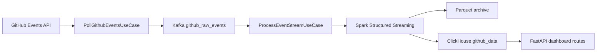
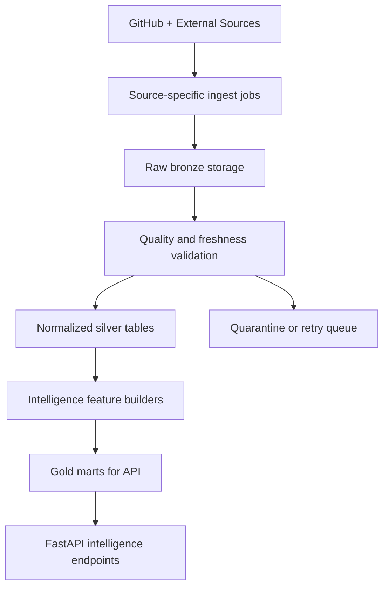

## Overview

Tai lieu nay chuyen huong `GitHub Analyzer` tu mot he thong `descriptive analytics`
thanh mot nen tang `AI ecosystem intelligence` co kha nang van hanh on dinh o quy mo
hang chuc den hang tram trieu event, dong thoi chiu duoc do khong on dinh cua
external data.

Muc tieu cua plan:

- thiet ke nhom use case uu tien cao de bao ve do on dinh he thong lon
- xac dinh cach dua use case vao kien truc hien tai ma khong lam phinh server/API
- chi ra nhung phan trong code nen giu, nen gop, nen bo manh tay

Scope:

- dua tren code va tai lieu hien co trong repo
- uu tien du lieu GitHub event, repo metadata, ClickHouse, Parquet, Kafka, Spark
- tinh them external data co gia tri cao nhu model catalog, benchmark, newsroom/news

Assumption:

- san pham dang huong toi `AI market intelligence` va `developer adoption intelligence`
- frontend moi se can nhieu signal tong hop hon la chi top repo va trending
- giai phap uu tien la on dinh van hanh, kiem soat chi phi, va de rollout theo tung pha

Non-goals:

- khong de xuat mot he thong ML ranking phuc tap ngay lap tuc
- khong de xuat ingest moi nguon web khong co hop dong API ro rang
- khong de xuat them dashboard endpoint neu chua co analytical model phia sau

## Current State

### Current architecture

Theo `README.md` va code hien tai, luong van hanh chinh la:



### Implemented now

- Ingestion da co token rotation, ETag caching, retry, rate-limit tracking trong
  [src/infrastructure/github/client.py](/home/iec/lamnh/github/src/infrastructure/github/client.py:1).
- Stream processing da co dual sink `Parquet + ClickHouse` trong
  [src/infrastructure/spark/streaming_job.py](/home/iec/lamnh/github/src/infrastructure/spark/streaming_job.py:1).
- Dashboard queries da co surface kha day du cho `top repos`, `trending`,
  `shock movers`, `topic rotation`, `language/topic breakdown`, `event volume` qua
  [src/presentation/api/dashboard_routes.py](/home/iec/lamnh/github/src/presentation/api/dashboard_routes.py:1).
- Repo-first discovery da co huong di rieng trong
  [src/application/use_cases/discover_repo_catalog.py](/home/iec/lamnh/github/src/application/use_cases/discover_repo_catalog.py:1).
- Runtime hien tai giu logging va pipeline status endpoint.

### Missing today

- Chua co `stability use case` o tang application de bao ve chat luong du lieu va
  suc khoe cua pipeline khi throughput tang manh.
- Chua co `external source ingestion contract` rieng cho model catalog, benchmark,
  newsroom, news impact.
- Chua co analytical layer cho cac use case intelligence nhu `breakout confidence`,
  `durability`, `false hype risk`, `source freshness`, `entity linking`.
- Chua co data quality gate de chan external data xau, duplicate, stale, schema drift.

### Current pain points relevant to scale

- Production serving da chot 1 nhanh `ClickHouse`, nhung analytical service va route cu van can
  tiep tuc duoc tach nho theo use case de de review va rollout.
- Spark writer hien dang dua nhieu logic ve file counting, repartition, va write policy
  vao infrastructure layer, nhung chua co use case giam sat `batch lateness`,
  `sink skew`, `external backfill pressure`.
- Startup cua API dang bootstrap them repo metadata setup, nghia la mot process
  presentation dang kick off mot side effect ha tang khi khoi dong.

## Target State

### Product direction

He thong nen co 3 lop use case:

1. `Intelligence use case`
2. `Stability and guardrail use case`
3. `External data control use case`

Neu khong co lop 2 va 3, lop 1 se kho tin cay khi du lieu tang tu hang chuc trieu len
hang tram trieu record.

### Target runtime flow



### Target principles

- `Raw -> validated -> curated -> serving` ro rang thay vi query truc tiep tren raw va fallback.
- Moi external source phai co `freshness`, `schema version`, `dedup strategy`, `error budget`.
- Moi use case intelligence phai co `confidence score` va `explanation trace`.
- Serving layer chi doc tu `gold marts` da tong hop, tranh de API query den raw facts qua nang.

## 1. Design Use Case

### Group A. Intelligence use case co gia tri san pham cao

#### 1. AI Repo Breakout Detector

Value: cao nhat, co the xay som nhat.

Muc tieu:

- phat hien repo breakout som truoc khi stars all-time kip phan anh day du
- tach `momentum that is durable` voi `spike due to noise`

Input:

- GitHub events
- repo metadata
- category classifier

Output:

- `breakout_score`
- `durability_score`
- `false_hype_risk`
- `confidence_score`

Signals de xay:

- watch velocity 24h, 72h, 7d
- fork velocity
- push continuity
- issue intensity
- owner concentration risk
- new contributor proxy

#### 2. Ecosystem Rotation Map

Muc tieu:

- cho thay attention dang chuyen tu category nao sang category nao
- dung cho PM, VC, devrel, strategy

Input:

- topics
- description
- language
- repo category/taxonomy

Output:

- `rotation_into`
- `rotation_out_of`
- `category_heat`
- `durability_by_category`

Gap hien tai:

- category classifier hien chua du sau cho cac cum AI nhu `coding agents`,
  `browser/computer-use`, `eval tooling`, `multimodal`, `safety`, `inference serving`.

#### 3. Adoption Lag After Model Launch

Muc tieu:

- do do tre giua model launch/news launch va builder activity tren GitHub

Can them:

- model catalog
- official launch/news events
- entity linking giua repo va model/provider/framework

Output:

- `time_to_first_repo`
- `time_to_10_active_repos`
- `sustained_activity_after_launch`
- `lag_elasticity`

#### 4. News-to-Code Impact Tracker

Muc tieu:

- bien announcement/news thanh chuoi giai thich co bang chung

Output:

- news item -> entities -> repos affected -> 24h/72h/7d reaction
- `impact_confidence`
- `impact_decay`
- `secondary affected categories`

#### 5. Competitive Radar for Frameworks

Muc tieu:

- so sanh framework/e2e ecosystem theo tang truong, do ben, su quay lai cua attention,
  va muc do tao he sinh thai.

Output:

- `framework_momentum`
- `retention_of_attention`
- `ecosystem_depth`
- `decline_risk`

### Group B. Stability use case can co truoc khi scale manh

#### 6. Source Freshness Guard

Muc tieu:

- phat hien nguon nao dang stale truoc khi no lam hong dashboard va scoring

Ap dung cho:

- GitHub Events API
- repo metadata sync
- Artificial Analysis / OpenRouter / Hugging Face / newsroom

Output:

- `last_success_at`
- `freshness_sla_breached`
- `degraded_reason`

#### 7. External Data Quarantine

Muc tieu:

- khong cho data schema drift, duplicate, partial payload, va stale records di thang vao serving tables

Rules:

- validate schema
- validate essential entity keys
- version payload
- quarantine record xau vao raw error table hoac file

#### 8. Backpressure and Cost Guard

Muc tieu:

- tranh de Kafka, Spark, ClickHouse, va API bi day qua nguong khi burst traffic hoac backfill

Output:

- `ingest_lag`
- `spark_batch_delay`
- `clickhouse_insert_pressure`
- `api_query_cost_tier`

#### 9. Data Quality Regression Watcher

Muc tieu:

- phat hien regressions nhu drop dot ngot WatchEvent, mapping sai repo name,
  category bi roi ve `Other`, external source mat entity coverage

Output:

- completeness ratio
- duplicate ratio
- null-key ratio
- category coverage ratio

#### 10. Serving Read Model Protection

Muc tieu:

- dashboard va frontend chi doc tu bang tong hop/toi uu, tranh query nang tren raw facts

Output:

- curated gold marts cho `breakout`, `rotation`, `news impact`, `adoption lag`, `radar`

### Group C. External data use case can uu tien

#### 11. Model Catalog Sync

Nguon uu tien:

- OpenRouter
- Hugging Face Hub
- Artificial Analysis

Muc tieu:

- co mot dimension table chung cho `model`, `provider`, `pricing`, `modality`,
  `benchmark_snapshot`, `launch_date`

#### 12. Official Launch and News Sync

Nguon uu tien:

- OpenAI news
- Anthropic news
- Google AI blog
- newsroom/API feed co contract on dinh

Muc tieu:

- build `launch_event` va `news_event` bang source co do tin cay cao
- de sau do moi mo rong sang media layer

#### 13. Entity Linking and Taxonomy Builder

Muc tieu:

- noi repo voi model, framework, provider, modality, va AI category

Phuong an pha 1:

- rule-based + keyword dictionary + topic mapping

Phuong an pha 2:

- hybrid embedding/entity resolution neu can them do chinh xac

## 2. Cach Tich Hop Use Case Vao Du An

### Layer ownership

`presentation -> application -> domain <- infrastructure` van giu nguyen.

#### Domain

Nen them contracts va value objects cho:

- `SourceFreshnessStatus`
- `ExternalDatasetType`
- `ConfidenceScore`
- `BreakoutScore`
- `LinkedEntity`
- `QualityGateResult`

Khong nen dua SQL, HTTP client, hay Spark logic vao day.

#### Application

Nen them use case moi theo nhom:

- `build_breakout_rankings`
- `build_ecosystem_rotation`
- `build_news_code_impact`
- `build_adoption_lag`
- `sync_external_model_catalog`
- `sync_news_events`
- `validate_external_snapshot`
- `evaluate_pipeline_health`

Application layer se orchestration workflow va chot business rules nhu:

- freshness SLA nao thi xem la stale
- score nao du dieu kien hien tren dashboard
- record nao phai vao quarantine

#### Infrastructure

Nen tach ro adapter theo nguon:

- `src/infrastructure/external/openrouter_client.py`
- `src/infrastructure/external/huggingface_client.py`
- `src/infrastructure/external/artificial_analysis_client.py`
- `src/infrastructure/external/news_source_client.py`

Nen them storage/modeling theo tier:

- raw snapshots
- normalized tables
- gold marts

Khong nen tiep tuc day tat ca logic analytical vao 1 service SQL duy nhat.

#### Presentation

Frontend intelligence pages nen goi endpoint doc tu gold marts, vi du:

- `/intelligence/breakout`
- `/intelligence/rotation`
- `/intelligence/news-impact`
- `/intelligence/adoption-lag`
- `/intelligence/radar`

Khong nen de frontend query truc tiep vao raw event summaries de tu lap score.

### Recommended storage pattern

#### Required

- `github_data` giu vai tro raw fact event trong ClickHouse
- `repo_metadata` giu dimension repo
- them bang curated/gold:
  - `breakout_repo_scores`
  - `ecosystem_rotation_daily`
  - `external_model_catalog`
  - `external_news_events`
  - `entity_links`
  - `adoption_lag_facts`
  - `framework_radar_daily`
  - `source_health_snapshots`

#### Optional

- parquet raw cho external snapshots neu muon reprocess re
- quarantine table cho invalid external records

#### Not needed now

- vector database rieng chi de lam taxonomy, neu rule-based phase 1 da du

### Execution model de toi uu server

Nen tach workload thanh 4 nhom:

1. `real-time ingest`
   GitHub events -> Kafka -> Spark -> raw stores
2. `scheduled enrich`
   repo metadata, model catalog, news sync theo gio/ngay
3. `feature builders`
   build bang gold theo batch 15m, 1h, hoac daily tuy use case
4. `serving API`
   chi doc bang tong hop da duoc precompute

Loi ich:

- giam CPU va memory peak tren API
- giam query full scan len ClickHouse raw table
- de dat SLA rieng cho ingest va serving

### Query strategy de tranh nghen

- `top/trending/breakout` phai doc tu summary table, khong tinh lai tu raw facts moi request.
- `adoption lag` va `news impact` nen duoc build bang batch job, khong lam realtime fanout query.
- `pipeline status` va `source health` nen co snapshot table hoac metric series rieng.

### Config plan

Nen them cac config theo nhom:

- external source enable flags
- per-source timeout, retry, freshness SLA
- batch cadence cho feature builders
- quarantine destination
- serving query limits cho tung endpoint intelligence

Vi du shape:

```toml
[external.openrouter]
enabled = true
sync_interval_minutes = 60
timeout_seconds = 15
freshness_sla_minutes = 180

[external.news]
enabled = true
sync_interval_minutes = 30
freshness_sla_minutes = 120

[features.breakout]
build_interval_minutes = 15
max_lookback_days = 30
```

## 3. Nhung Phan Khong Can Dung Va Nen Xoa Manh Tay

### Remove or deprecate first

| Path | Action | Brief change | Why |
|---|---|---|---|
| `src/infrastructure/storage/clickhouse_dashboard_service.py` | Split | Tach thanh nhieu query service theo use case thay vi 1 file SQL qua lon | De toi uu query, review, test, va rollout tung intelligence mart |
| `src/presentation/api/dashboard_routes.py` | Modify | Dua dashboard doc dan tu curated marts khi tung use case san sang | Tranh API layer phai ganh mapping va branch logic phuc tap |

### Clean aggressively if target la premium intelligence product

#### 1. Xoa serving duplication

Nen chot 1 chuan production serving:

- ClickHouse cho online analytics
- Parquet chi de archive, backfill, recovery, offline exploration

Parquet giu vai tro archive, backfill, recovery.

#### 2. Xoa fallback query de che thieu data model

`ClickHouseDashboardService` khong nen tiep tuc giu fallback query. Neu `repo_metadata`
hoac `repo_metadata_history` chua san sang, endpoint nen fail ro rang de rollout du lieu va
serving duoc kiem soat dung boundary.

#### 3. Xoa logic intelligence khoi presentation

Presentation layer chi nen:

- validate input
- goi use case
- return DTO

Khong nen map score, confidence, fallback, va analytical branching o route.

#### 4. Xoa endpoint chi phuc vu dashboard cu neu khong phu hop san pham moi

Neu frontend moi khong con dung cac endpoint `/events/top-repos`, `/events/volume`, `/events/hourly`,
nen dua chung ve `internal diagnostics` hoac remove sau migration. Day la cac endpoint hop voi
analytics demo hon la intelligence terminal.

#### 5. Xoa su phu thuoc vao raw fact queries trong request path

Moi page intelligence moi nen doc tu precomputed table. Neu mot endpoint can scan lai raw data
trong request path, do la dau hieu chua san sang production scale.

## Planned Changes And File Impact

| Path | Action | Brief change | Why |
|---|---|---|---|
| `docs/ai_usecase_research.md` | Modify | Ghi lai thanh planning doc implementation-oriented | Tao tai lieu de frontend, backend, va data cung bam theo |
| `src/domain/` | Tentative modify | Them value objects/exceptions/contracts cho source health, confidence, quality gate | Can ownership ro rang cho business meaning |
| `src/application/use_cases/` | Tentative add | Them use case sync external, build gold marts, validate quality, health evaluation | Day la noi orchestration dung boundary |
| `src/infrastructure/external/` | Tentative add | Them clients cho OpenRouter, HF, Artificial Analysis, newsroom | Tach rieng integration theo tung nguon |
| `src/infrastructure/storage/` | Tentative modify | Tach query services va them repositories cho gold marts + health snapshots | Giam file monolith, tang kha nang scale query |
| `src/presentation/api/` | Tentative modify | Them intelligence endpoints, giam route cu khong con phu hop product path moi | Phu hop huong san pham moi |
| `scheduler/` | Tentative modify | Them jobs cho sync external, build features, data quality checks | Dung scheduled execution thay vi startup side effect |
| `tests/` | Tentative add/modify | Them tests cho quality gates, external sync, intelligence marts | Bao ve rollout va regressions |

## Definition Of Done

- Co tai lieu thong nhat ve use case, architecture fit, va cleanup scope.
- Moi intelligence page co use case va data contract ro rang.
- Moi external source co ingest contract, freshness SLA, va quarantine path.
- Serving API chi doc tu curated marts cho use case intelligence chinh.
- Serving path analytics product chi con phu thuoc vao ClickHouse va curated tables.
- Co monitoring cho freshness, lag, duplicate rate, schema drift, va category coverage.

## Testing And Verification Strategy

### Unit

- scoring rules cho breakout/durability/confidence
- taxonomy mapping va entity linking rules
- freshness and quarantine decision rules

### Integration

- external source sync -> normalized snapshot -> quality validation
- Spark/ClickHouse batch build -> gold marts
- dashboard/intelligence API -> curated tables

### Performance

- test query latency tren bang gold o khung 10M, 50M, 100M events
- test backfill khong anh huong API latency qua nguong cho phep

### Negative path

- external API timeout
- schema drift tu source
- duplicate news item
- stale metadata snapshot
- category classifier roi qua nhieu vao `Other`

### Required quality gates for implementation phase

```bash
uv run ruff check .
uv run ruff format --check .
uv run mypy src
uv run pytest -v
```

## Sequential Implementation Plan

1. Chot serving strategy
   Objective: quyet dinh ClickHouse la production serving source of truth, Parquet la archive/recovery.
   Affected area: API routes, dashboard service, docs.
   Dependency: none.
   Output artifact: ADR nho hoac doc update.
   Validation: tat ca product endpoints co source doc ro rang.

2. Dung data model cho intelligence marts
   Objective: thiet ke bang `breakout`, `rotation`, `news impact`, `adoption lag`, `radar`, `source health`.
   Affected area: storage schema, repositories, query services.
   Dependency: step 1.
   Output artifact: schema plan + repositories.
   Validation: review duoc cardinality, partitioning, query keys.

3. Them guardrails cho external data
   Objective: co freshness SLA, schema validation, quarantine.
   Affected area: domain/application/infrastructure external sync.
   Dependency: step 2.
   Output artifact: validation pipeline cho external snapshots.
   Validation: test stale/invalid payload.

4. Build 2 use case co gia tri cao nhat truoc
   Objective: `Breakout Detector` va `Ecosystem Rotation`.
   Affected area: feature builders, gold marts, API.
   Dependency: step 2.
   Output artifact: precomputed tables + endpoints.
   Validation: response nhanh va on dinh tren data lon.

5. Build launch/news intelligence
   Objective: `Adoption Lag` va `News-to-Code Impact`.
   Affected area: external sync, entity linking, feature builders.
   Dependency: step 3.
   Output artifact: linked launch/news tables + endpoints.
   Validation: sample news item trace duoc den repo impact.

6. Clean production path
   Objective: giu 1 serving path ClickHouse, bo fallback query, move startup bootstrap sang scheduler.
   Affected area: routes, storage, scheduler.
   Dependency: step 4 toi thieu.
   Output artifact: don gian hoa runtime path.
   Validation: endpoint behavior on dinh, logging va pipeline status du de debug.

## Commit Plan

1. `docs(ai): define intelligence and stability use case roadmap`
   Objective: chot use case, target architecture, cleanup scope.

2. `feat(storage): add curated intelligence marts and source health contracts`
   Objective: tao nen tang luu tru phuc vu serving va guardrails.

3. `feat(external): add model catalog and news sync with quarantine flow`
   Objective: dua external data vao he thong co kiem soat.

4. `feat(intelligence): build breakout and ecosystem rotation pipelines`
   Objective: ship 2 use case gia tri cao nhat som nhat.

5. `feat(intelligence): add adoption lag and news impact analytics`
   Objective: mo rong sang giai thich va causal intelligence.

6. `refactor(api): slim dashboard serving around ClickHouse-only reads`
   Objective: clean production path, giam complexity, toi uu server.

## Cleanup Recommendation Summary

- Giu: Kafka, Spark, ClickHouse, Parquet, repo discovery, metrics foundation.
- Gop lai: analytical SQL services theo tung use case thay vi 1 file lon.
- Xoa manh tay: fallback query keo dai tinh trang thieu model,
  startup side effects trong presentation, va moi endpoint cu khong phuc vu intelligence product.

## Risk And Open Questions

Risk:

- external data co the on dinh kem hon GitHub, nen phai co quarantine va freshness gating
- entity linking neu lam qua som bang ML/embedding se doi complexity van hanh len cao
- neu khong precompute gold marts, API se nhanh chóng cham khi frontend moi bat dau goi nhieu widget

Open question:

- co uu tien them official newsroom sources truoc, hay di thang vao media/news aggregation
- cadence nao hop ly cho `breakout` va `rotation`: 15 phut, 1 gio, hay daily

## Recommendation

Thu tu uu tien de toi uu gia tri va on dinh:

1. Chot `ClickHouse = serving source of truth`, `Parquet = archive/recovery`.
2. Ship `Breakout Detector` va `Ecosystem Rotation` tren curated marts.
3. Them `Source Freshness Guard` va `External Data Quarantine` truoc khi mo rong external data.
4. Sau do moi build `Adoption Lag` va `News-to-Code Impact`.
5. Don dep manh tay route/service cu khong con phuc vu product intelligence moi.

## Phase Roadmap

### Phase 0. Stabilize the serving path

Muc tieu:

- dong bo production serving path
- giam complexity truoc khi them use case moi

Deliverables:

- chot `ClickHouse` la source of truth cho serving
- tach bootstrap side effect khoi API startup
- viet ro ADR nho cho `raw/silver/gold` strategy

Thanh cong khi:

- khong con endpoint product nao phu thuoc vao fallback query
- logging va pipeline status du ro de debug ingest, freshness, va query latency

### Phase 1. Ship the first two intelligence products

Muc tieu:

- dua len duoc 2 page manh nhat va kha thi nhat voi data hien co

Deliverables:

- `Breakout Detector`
- `Ecosystem Rotation`
- curated marts:
  - `breakout_repo_scores`
  - `ecosystem_rotation_daily`
- API endpoints cho 2 use case nay

Thanh cong khi:

- frontend co the render page tu curated marts, khong scan raw facts theo request
- query p95 cho page chinh giu o muc on dinh da dat SLA

### Phase 2. Add external data controls

Muc tieu:

- dua external data vao he thong ma khong lam mat do tin cay

Deliverables:

- `Model Catalog Sync`
- `Official Launch and News Sync`
- `Source Freshness Guard`
- `External Data Quarantine`
- `source_health_snapshots`

Thanh cong khi:

- moi source co freshness SLA va quarantine path
- stale source khong lam sai gold marts dang phuc vu frontend

### Phase 3. Launch explainability products

Muc tieu:

- bien he thong thanh intelligence terminal, khong chi ranking terminal

Deliverables:

- `Adoption Lag After Model Launch`
- `News-to-Code Impact Tracker`
- `Entity Linking and Taxonomy Builder`
- curated marts:
  - `external_model_catalog`
  - `external_news_events`
  - `entity_links`
  - `adoption_lag_facts`

Thanh cong khi:

- moi insight chinh co `confidence score` va `explanation trace`
- team co the giai thich duoc tai sao repo/category tang truong

### Phase 4. Hardening and removal

Muc tieu:

- don dep code cu, giam debt, toi uu chi phi van hanh

Deliverables:

- remove hoac co lap legacy routes
- split `ClickHouseDashboardService` thanh query modules nho
- toi uu scheduler va feature builder cadence
- them performance regression checks cho 10M/50M/100M

Thanh cong khi:

- serving path ngan, ro, de debug
- query/service ownership ro theo use case

## Frontend Mapping

De frontend moi va backend di cung nhip, nen map page -> use case -> data mart nhu sau:

| Frontend page | Primary use case | Main data mart | Notes |
|---|---|---|---|
| Landing / Overview | Breakout summary + weekly intelligence summary | `breakout_repo_scores`, `ecosystem_rotation_daily` | Chi doc summary tiers, khong query raw |
| Main dashboard | Breakout, rotation, risk, durability | `breakout_repo_scores`, `framework_radar_daily`, `source_health_snapshots` | Page tong hop cho exec view |
| Breakout Detector | AI Repo Breakout Detector | `breakout_repo_scores` | Can rank, filter, confidence, durability |
| Ecosystem Rotation | Ecosystem Rotation Map | `ecosystem_rotation_daily` | Can flow, heat, category movement |
| News Impact | News-to-Code Impact Tracker | `external_news_events`, `entity_links`, mart impact daily | Can explanation trace |
| Adoption Lag | Adoption Lag After Model Launch | `adoption_lag_facts`, `external_model_catalog` | Can timeline va lag curves |
| Weekly Brief | Weekly intelligence digest | summary tables build theo batch | Nen pre-render mot phan content |
| Competitive Radar | Competitive Radar for Frameworks | `framework_radar_daily` | Can ranking, trajectory, risk |

## KPI And SLA Proposal

### Product-facing SLA

- dashboard/intelligence endpoint p95 < `500ms` voi curated marts
- heavy comparative endpoint p95 < `1200ms`
- freshness cho breakout/rotation <= `15 phut`
- freshness cho model/news external sync <= `1-3 gio` tuy source

### Pipeline-facing SLA

- Kafka consumer lag khong vuot nguong canh bao da dinh nghia
- Spark batch delay khong vuot `2` chu ky trigger lien tiep
- ClickHouse insert failure rate < `1%` theo cua so 1 gio
- external source success ratio >= `95%` theo cua so ngay

### Data quality KPI

- duplicate event ratio < `0.5%`
- null essential key ratio ~ `0%`
- category coverage ngoai `Other` dat muc muc tieu da chot theo taxonomy phase
- linked-entity coverage tang theo phase, khong ep muc tieu qua cao ngay tu dau

## Suggested Build Order By Team

### Backend/data can lam truoc frontend hard-bind

1. Chot schema cho `breakout_repo_scores`.
2. Chot schema cho `ecosystem_rotation_daily`.
3. Chot health snapshot model cho external va internal source.
4. Chot endpoint contracts cho `/intelligence/breakout` va `/intelligence/rotation`.

### Frontend co the mock song song

1. Landing page va dashboard shell.
2. Breakout page.
3. Ecosystem rotation page.
4. Weekly brief preview modules.

### Chi nen bind sau khi external layer on dinh

1. News impact page.
2. Adoption lag page.
3. Competitive radar neu can entity linking sau hon.

## Implementation Notes For The Next Doc Or PR

Neu tiep tuc sang buoc implementation, tai lieu tiep theo nen la mot `technical design doc`
cho `Phase 1` gom:

- schema cua `breakout_repo_scores`
- schema cua `ecosystem_rotation_daily`
- scoring formula version `v1`
- API contracts cho 2 endpoint intelligence dau tien
- migration plan khoi cac legacy public analytics routes
- testing plan cho load va regressions
