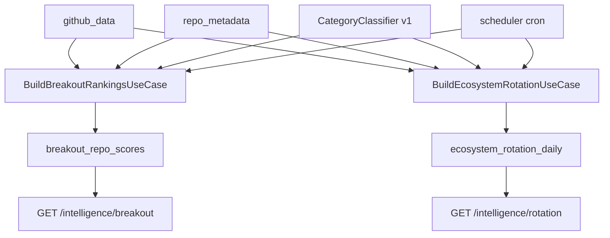

# Phase 1 Implementation Doc

## 1. Overview

Tai lieu nay mo ta cach implement `Phase 1` cho san pham `AI ecosystem intelligence`
dua tren repo hien tai. Day la execution document, khac voi planning doc va technical
design doc o cho no tap trung vao:

- thu tu lam viec thuc te
- file impact cu the
- schema va config can them
- job/runtime hooks
- testing, rollout, va rollback

Scope:

- `CategoryClassifier v1`
- `breakout_repo_scores`
- `ecosystem_rotation_daily`
- `GET /intelligence/breakout`
- `GET /intelligence/rotation`
- migration path khoi route/fallback cu cho frontend moi

Assumption:

- `ClickHouse` duoc chot la production serving source of truth
- `Parquet` tiep tuc la archive/backfill/recovery path
- frontend moi se uu tien bind `Breakout` va `Rotation` truoc

Non-goals:

- chua implement external model/news ingestion
- chua remove ngay dashboard routes cu
- chua lam ML classifier hoac embedding entity linking

## 2. Current Project State

### Implemented now

- Raw ingestion va streaming da on dinh voi Kafka, Spark, ClickHouse, Parquet.
- Dashboard API hien co `trending`, `shock movers`, `topic rotation`.
- Scheduler conventions da co san trong `scheduler/scripts/` va duoc install qua
  [scheduler/crontab_install.sh](/home/iec/lamnh/github/scheduler/crontab_install.sh:1).

### Missing today

- khong co curated mart cho breakout/rotation
- khong co intelligence routes rieng
- khong co category taxonomy dung nghia AI
- khong co build job dinh ky cho Phase 1 features

### Gap

- design doc da xac dinh schema va scoring, nhung repo chua co execution path
  de build va serve 2 use case nay.

## 3. Concept And Runtime Flow



Runtime model:

- feature builders chay theo lich, khong chay trong request path
- API chi query curated tables
- frontend moi khong can fallback ve dashboard raw analytics

## 4. Implementation Approach

### Owning layers

#### Domain

Phan nay so huu:

- category taxonomy v1
- score semantics
- response concepts nhu `confidence`, `durability`, `false_hype_risk`

Can them hoac sua:

- [src/domain/services/category_classifier.py](/home/iec/lamnh/github/src/domain/services/category_classifier.py:1)
- co the them value object moi neu implementation bat dau lap logic score o nhieu noi

#### Application

Phan nay so huu orchestration:

- `build_breakout_rankings.py`
- `build_ecosystem_rotation.py`

Trach nhiem:

- goi repositories/query services
- ap scoring rules v1
- ghi snapshot vao marts
- emit logging cho build result

#### Infrastructure

Phan nay so huu:

- ClickHouse table creation/migration
- repository/query service cho breakout va rotation marts
- scheduler scripts hoac invocation wrappers

#### Presentation

Phan nay chi nen:

- validate query params
- goi mart query service/use case doc curated data
- return DTO

### Required changes

#### Required

- rule-based category taxonomy v1
- ClickHouse marts `breakout_repo_scores`, `ecosystem_rotation_daily`
- DTO moi cho intelligence routes
- route moi duoi `/intelligence/*`
- scheduler scripts moi cho build jobs

#### Optional

- `evidence_json` va `top_rising_repos_json` cho UI explanation
- separate internal admin endpoint de trigger rebuild thu cong

#### Not needed now

- external source tables
- vector search
- async worker system moi ngoai cron/scheduler conventions dang co

### Config plan

Can them keys vao [src/infrastructure/config.py](/home/iec/lamnh/github/src/infrastructure/config.py:1):

- `breakout_build_interval_minutes`
- `rotation_build_interval_minutes`
- `breakout_max_lookback_days`
- `rotation_window_days`
- `intelligence_query_default_limit`
- `intelligence_query_max_limit`

Example shape:

```toml
[features.breakout]
build_interval_minutes = 15
max_lookback_days = 30
default_window_hours = 72

[features.rotation]
build_interval_minutes = 60
window_days = 7

[api.intelligence]
default_limit = 20
max_limit = 100
```

## 5. Planned Changes And File Impact

| Path | Action | Brief change | Why |
|---|---|---|---|
| `src/domain/services/category_classifier.py` | Modify | Doi tu neutral fallback thanh rule-based taxonomy v1 | Rotation va breakout can category co y nghia |
| `src/application/use_cases/build_breakout_rankings.py` | Add | Build mart breakout theo snapshot | Tao execution path cho `breakout_repo_scores` |
| `src/application/use_cases/build_ecosystem_rotation.py` | Add | Build mart rotation theo snapshot | Tao execution path cho `ecosystem_rotation_daily` |
| `src/application/use_cases/__init__.py` | Modify | Export use cases moi | Giu convention package exports |
| `src/application/dtos/` | Add | DTO moi cho intelligence routes | Tach contract moi khoi dashboard DTO cu |
| `src/infrastructure/storage/` | Add | Repositories/query services cho breakout va rotation marts | ClickHouse la source of truth |
| `src/infrastructure/config.py` | Modify | Them config keys cho cadence va query limits | Giam hardcode |
| `src/presentation/api/intelligence_routes.py` | Add | Routes moi cho breakout va rotation | Frontend bind endpoint moi |
| `src/presentation/api/routes.py` | Modify | Include router moi, chua remove route cu | Rollout an toan |
| `scheduler/scripts/11_build_breakout_rankings.sh` | Add | Cron wrapper cho breakout builder | Build dinh ky |
| `scheduler/scripts/12_build_ecosystem_rotation.sh` | Add | Cron wrapper cho rotation builder | Build dinh ky |
| `scheduler/crontab_install.sh` | Modify | Dang ky 2 cron jobs moi | Dua Phase 1 vao van hanh |
| `tests/domain/` | Modify/Add | Test taxonomy v1 | Bao ve phan loai |
| `tests/application/` | Add | Test build use cases | Bao ve scoring va orchestration |
| `tests/presentation/` | Add | Test intelligence routes | Bao ve API contract |
| `tests/infrastructure/` | Add | Test mart repositories/query services | Bao ve ClickHouse serving path |

### API contract impact

Them endpoints moi:

- `GET /intelligence/breakout`
- `GET /intelligence/rotation`

Backward compatibility:

- giu lai `/dashboard/trending` va `/dashboard/topic-rotation` trong Phase 1
- frontend moi se chuyen sang endpoint intelligence

### DB migration impact

Can them 2 table ClickHouse moi:

- `breakout_repo_scores`
- `ecosystem_rotation_daily`

Migration strategy:

- create-if-not-exists
- backfill snapshot dau tien bang job thu cong hoac scheduler run

### Runtime health impact

Can them logging va state snapshots cho:

- build duration
- build row count
- build last success timestamp
- build failure count

### Deployment impact

- can rebuild/restart service neu them use case executable moi
- can cap nhat cron install script neu production dang dung scheduler block hien tai

## 6. Definition Of Done

- `CategoryClassifier v1` classify duoc repo AI vao taxonomy huu dung.
- `breakout_repo_scores` va `ecosystem_rotation_daily` duoc tao va co du lieu.
- `GET /intelligence/breakout` va `GET /intelligence/rotation` tra du lieu tu curated marts.
- frontend co the bind 2 page dau tien ma khong phu thuoc vao raw analytics routes.
- build jobs co logging va scheduler integration.
- tests pass va quality gates xanh.

## 7. Testing And Verification

### Unit tests

- `CategoryClassifier` map topics/description dung vao category expected
- scoring formula cho breakout, durability, false hype risk, confidence
- edge cases khi metadata thieu hoac category roi ve fallback

### Integration tests

- build breakout mart tu fixture `github_data + repo_metadata`
- build rotation mart tu fixture co current/prior windows
- intelligence routes doc dung curated rows

### Contract tests

- response shape cho `/intelligence/breakout`
- response shape cho `/intelligence/rotation`
- query param bounds cho `limit`, `window_hours`, `window_days`

### Performance checks

- build job hoan thanh trong cua so chap nhan duoc tren fixture lon
- endpoint p95 dat SLA khi query curated mart

### Negative paths

- bang mart rong
- repo metadata thieu
- scheduler chay nhung ClickHouse tam thoi khong reachable
- category coverage roi qua thap

### Manual QA scenarios

1. Trigger build breakout, verify co snapshot moi trong ClickHouse.
2. Goi `/intelligence/breakout`, verify items co `breakout_score`, `durability_score`, `confidence_score`.
3. Trigger build rotation, verify category rising/falling thay doi theo fixture.
4. Frontend bind mock page vao endpoint moi, verify khong can them raw fallback.

### Required quality gates

```bash
uv run ruff check .
uv run ruff format --check .
uv run mypy src
uv run pytest -v
```

## 8. Sequential Implementation Plan

1. Nang cap taxonomy v1
   Objective: bien category classifier thanh AI taxonomy co y nghia.
   Affected area: domain, tests.
   Dependency: none.
   Output artifact: classifier rules + tests.
   Validation: test cases category mapping pass, category coverage duoc cai thien.

2. Tao schema marts trong ClickHouse
   Objective: co table `breakout_repo_scores` va `ecosystem_rotation_daily`.
   Affected area: infrastructure storage, schema bootstrap.
   Dependency: step 1.
   Output artifact: create table logic va repository layer.
   Validation: table create thanh cong, read/write duoc.

3. Implement breakout builder
   Objective: build snapshot breakout tu raw facts va metadata.
   Affected area: application, infrastructure, tests.
   Dependency: step 2.
   Output artifact: `build_breakout_rankings.py` + logging.
   Validation: snapshot co rows, scoring fields dung range.

4. Implement breakout serving API
   Objective: expose `GET /intelligence/breakout`.
   Affected area: DTOs, presentation routes, tests.
   Dependency: step 3.
   Output artifact: route + contract tests.
   Validation: endpoint tra response dung schema, latency dat muc tieu.

5. Implement rotation builder
   Objective: build `ecosystem_rotation_daily` theo current/prior window.
   Affected area: application, infrastructure, tests.
   Dependency: step 2 va step 1.
   Output artifact: `build_ecosystem_rotation.py`.
   Validation: category rising/falling hop ly tren fixture.

6. Implement rotation serving API
   Objective: expose `GET /intelligence/rotation`.
   Affected area: DTOs, presentation routes, tests.
   Dependency: step 5.
   Output artifact: route + contract tests.
   Validation: endpoint tra curated data dung schema.

7. Scheduler integration va rollout
   Objective: dua 2 build jobs vao cron conventions hien co.
   Affected area: scheduler scripts, crontab installer, docs.
   Dependency: step 3 va step 5.
   Output artifact: script wrappers + cron entries.
   Validation: scheduler run duoc, state/logs duoc ghi.

8. Frontend cutover cho 2 page dau tien
   Objective: bind frontend moi vao intelligence endpoints.
   Affected area: frontend consumer contracts, backend logging/health checks.
   Dependency: step 4 va step 6.
   Output artifact: page data binding moi.
   Validation: frontend khong con can dashboard raw routes cho 2 page nay.

## 9. Commit Plan

1. `feat(domain): implement category taxonomy v1`
   Objective: nang cap classifier len taxonomy AI rule-based.
   Files/modules: `src/domain/services/category_classifier.py`, tests domain/application lien quan.

2. `feat(storage): add breakout and rotation mart repositories`
   Objective: them ClickHouse marts va repository/query path.
   Files/modules: `src/infrastructure/storage/*`, bootstrap/schema logic, tests infrastructure.

3. `feat(intelligence): build breakout rankings pipeline`
   Objective: them use case build breakout va logging.
   Files/modules: `src/application/use_cases/build_breakout_rankings.py`, tests application.

4. `feat(api): add breakout intelligence endpoint`
   Objective: expose curated breakout data cho frontend.
   Files/modules: DTOs, `src/presentation/api/intelligence_routes.py`, route wiring, tests presentation.

5. `feat(intelligence): build ecosystem rotation pipeline`
   Objective: them use case build rotation.
   Files/modules: `src/application/use_cases/build_ecosystem_rotation.py`, storage support, tests.

6. `feat(api): add ecosystem rotation endpoint`
   Objective: expose curated rotation data cho frontend.
   Files/modules: DTOs, routes, tests.

7. `chore(scheduler): add phase1 intelligence build jobs`
   Objective: dua breakout va rotation vao cron/runtime path.
   Files/modules: `scheduler/scripts/*`, `scheduler/crontab_install.sh`, docs.

## 10. Rollout And Rollback

### Rollout

1. Deploy code co mart schema va builders.
2. Chay build thu cong lan dau de tao snapshot.
3. Enable scheduler jobs.
4. Expose intelligence endpoints.
5. Cho frontend bind theo environment staging truoc.
6. Sau khi on dinh moi mo ra production UI.

### Rollback

- neu builder loi: disable cron jobs moi, giu endpoints cu
- neu endpoint moi co issue: frontend quay lai mock/static data tam thoi hoac dashboard route cu
- khong can rollback raw ingestion path vi Phase 1 khong can doi luong ingest chinh

## 11. Risks, Dependencies, And Open Questions

### Risks

- taxonomy v1 neu qua hẹp se van day nhieu repo vao `other`
- scoring v1 neu khong normalize tot se uu ai repo baseline lon qua muc
- scheduler cadence qua day co the tang ap luc ClickHouse

### Dependencies

- ClickHouse co du schema migration path
- repo metadata du day de enrich signals
- frontend san sang dung contract moi

### Open questions

- co nen luu `evidence_json` dang string JSON hay tach thanh cot typed don gian hon
- co can them endpoint internal de trigger rebuild thu cong trong staging
- co nen build rotation moi 15 phut hay 1 gio trong phase dau

## 12. Recommendation

Neu muon ship nhanh nhat ma van an toan, thu tu thuc thi nen la:

1. `CategoryClassifier v1`
2. `breakout_repo_scores`
3. `/intelligence/breakout`
4. `ecosystem_rotation_daily`
5. `/intelligence/rotation`
6. scheduler integration

Ly do:

- `Breakout` la use case de show gia tri san pham som nhat
- `Rotation` phu thuoc vao category quality nhieu hon, nen nen di sau mot nhip
- rollout tach thanh 2 lan nho se de debug va de frontend nhan data som
